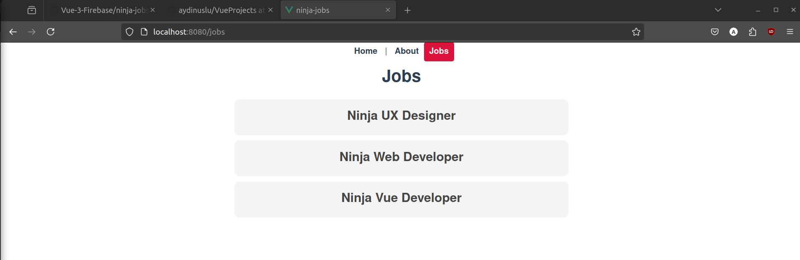

# modal-project

# screenshot
### when you click inside red area, modal window doesn't close
### to close the modal window you need to click grey backdrop area


## Project setup
```
npm install
```

### Compiles and hot-reloads for development
```
npm run serve
```

### Compiles and minifies for production
```
npm run build
```

### Customize configuration
See [Configuration Reference](https://cli.vuejs.org/config/).
