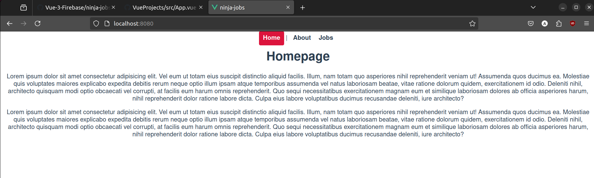

# reaction-timer


# screenshot
### when you click play, there is a random delay timer starts
### then delay timeouts and a block pops up


## Project setup
```
npm install
```

### Compiles and hot-reloads for development
```
npm run serve
```

### Compiles and minifies for production
```
npm run build
```

### Customize configuration
See [Configuration Reference](https://cli.vuejs.org/config/).
